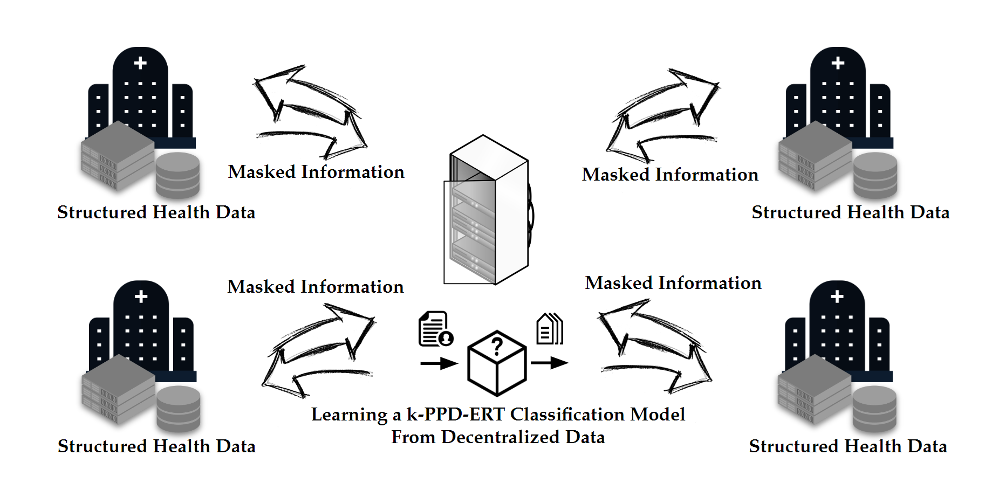

# Extremely Randomized Trees With Privacy Preservation for Distributed Structured Health Data

<div align="center">
  
</div>

The k-PPD-ERT framework is based on the Extremely Randomized Trees (ERT) algorithm for learning from distributed structured data. The data is assumed to be horizontally partitioned. To share partial information with the mediator, parties employ a Secure Multiparty Computation (SMC) layer on top of distributed ERT, which is robust to k colluding parties.

For the mediator, the server.py in the Mediator folder should be run. The number of data holer parties, scenario number, and name of data set is asked afterward. For the data holder parties, the client.py in the Data holder party folder should be run. Then, the number of data holer parties, number/ID of the data holder party (starting from 0), scenario number, and name of data set is asked. Finally, after starting parties, the learning process begins.


Related article:
A. Aminifar, M. Shokri, F. Rabbi, V. K. I. Pun and Y. Lamo, "Extremely Randomized Trees With Privacy Preservation for Distributed Structured Health Data," in IEEE Access, vol. 10, pp. 6010-6027, 2022, doi: 10.1109/ACCESS.2022.3141709.
https://ieeexplore.ieee.org/abstract/document/9676691

Video: https://youtu.be/DXpXzp9nnf4

## Citation
```
@article{aminifar2022extremely,
  title={Extremely randomized trees with privacy preservation for distributed structured health data},
  author={Aminifar, Amin and Shokri, Matin and Rabbi, Fazle and Pun, Violet Ka I and Lamo, Yngve},
  journal={IEEE Access},
  volume={10},
  pages={6010--6027},
  year={2022},
  publisher={IEEE}
}
```
